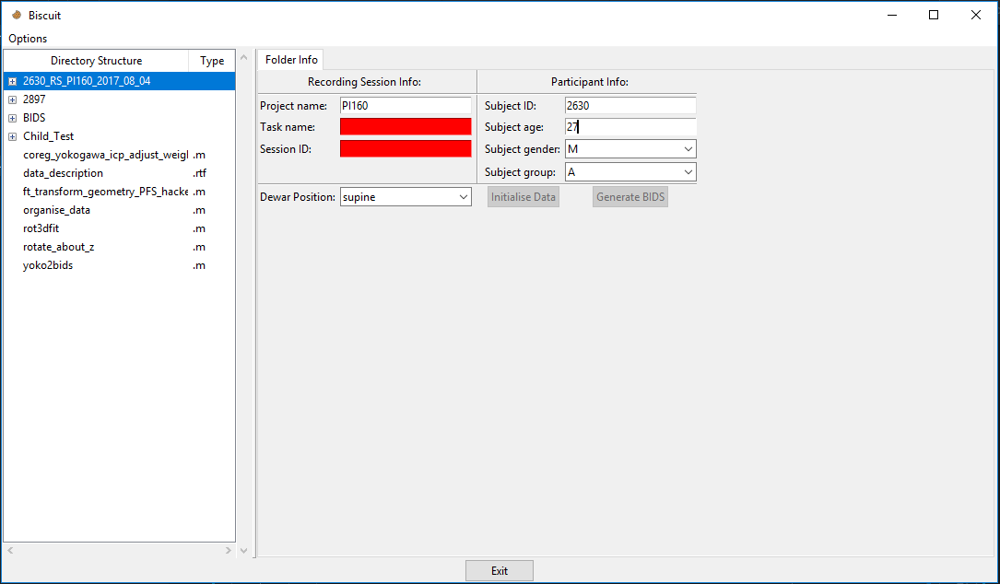
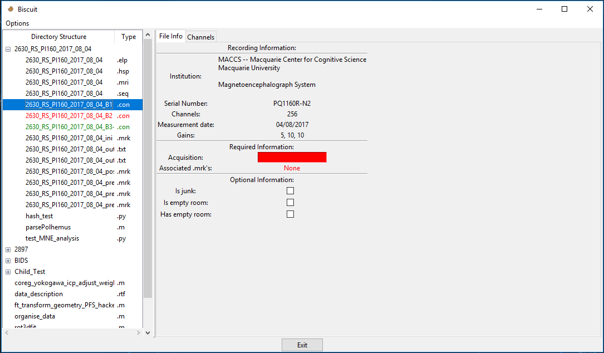
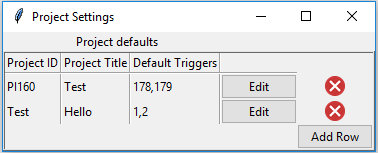
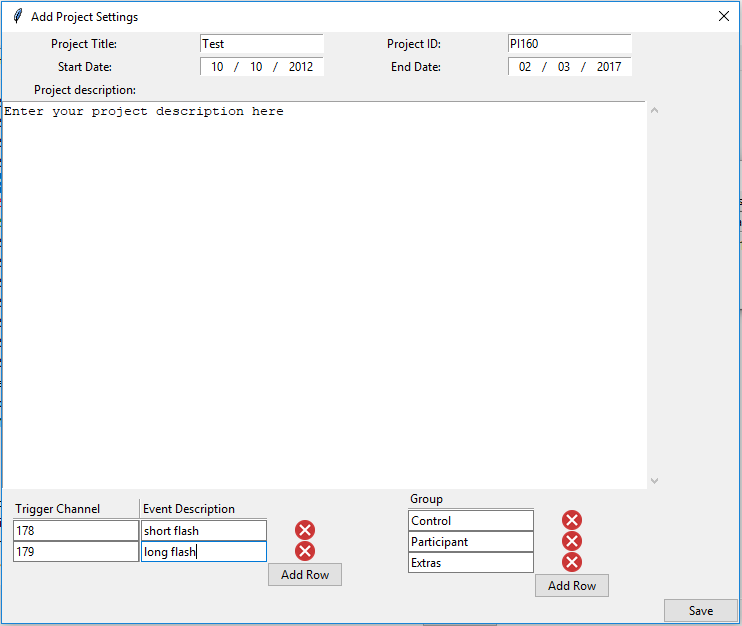

# Biscuit

## Description
Biscuit is a simple graphical application that facilitates the reformatting of raw KIT MEG data to comply with the international [BIDS specification](https://docs.google.com/document/d/1HFUkAEE-pB-angVcYe6pf_-fVf4sCpOHKesUvfb8Grc)

## Installation
Biscuit is written in Python and requires a number of pre-requisite libraries to operate.
### Installing pre-requisites:
#### Already have Python installed:
If you already have Python (>3.4 preferrably), install [MNE-Python](https://pypi.org/project/mne/) and ensure any required dependencies have been installed. Further, ensure [Pandas](https://pypi.org/project/pandas/) is installed (can be done easily with `pip install pandas`).
#### Don't have Python installed:
If you do not have a current Python install on your system, it is recommended that you install the [Anaconda](https://anaconda.org/anaconda/python) Python distribution. You can also follow the steps to [install MNE-Python](https://www.martinos.org/mne/stable/getting_started.html).
### Installing Biscuit:
Next Biscuit can be installed by cloning the github repo to your local drive.
This can be done from a browser by selecting the green `clone or download` button near the top right of the page, or by entering `git clone https://github.com/Macquarie-MEG-Research/Biscuit.git` into your favorite command line program. The second method requires [Git](https://git-scm.com/downloads) to be installed. You can check if your system has Git installed by entering `git --version` into your command prompt. If the version appears without error then it is installed.

## Usage
Biscuit can be run by running the `GUI.py` file with Python.
Upon running the script you will be greeting with two pop-ups.
The first pop-up will ask you to select the location of your MEG data. You need to select the parent folder that contains all of your MEG data, instead of a single folder which contains data from one session.
The second pop-up will ask for the path to your Matlab binary. The functionality to utilise this has however not been implemented yet so you can set this file to anything you wish.
### Main window:
Once these pop-ups have disappeared you will be greeted with a window that will look something like this:

Selecting a folder as shown will bring up the *Folder Info* tab where you can enter important info about the recording session. In general, if a field is red, it is required for conversion to BIDS format, and the process won't be allowed until a session has no red fields remaining.
### .CON file window:
If a folder is expanded and a con file clicked on you will see

Here we see information about the con file as well as some properties to enter.
- Selecting *Is junk* will cause the con file to not be copied to the destination directory.
- Selecting *Is empty room* will cause the con file to be processed as an empty room (these are handled in a specifc way for BIDS). You can only have one specified per session folder.
- Selecting *Has empty room* will give the con file a property which indicates the path of the associated empty room file. Note that there is not check on whether or not this empty room file actually exists. If you do not have any empty room data that was taken on the same day as this con file, **do not** check this box as the data will not be correct.
### Settings windows:
Selecting `Options > Set Defaults` will bring up the following window:

This window will have more options added shortly, but for now it is a simple screen where you can add default settings to the different projects.
Clicking `Add Row` brings up another popup:

It is on this screen that you can enter the defaults.
Any data entered here is applied to all other projects with the same `Project ID`.
Trigger channels can be specified with a default description so that any data will automatically have these channels specified as trigger channels with the given description.
Groups can be added so that the participants can be assigned to a group which will be recorded in the participants.tsv file in the project folder on export.

### Exporting the data
Once all required fields have been completed, and all con files have an mrk file associated with them, the `Initialise Data` button will be able to be pressed in the `Folder Info` tab. Once this is pressed and is complete, the `Generate BIDS` button will become active. Pressing this button will begin the processing of data to the BIDS format. This can take about 5 seconds per con file being processed, so allow it some time. A progress popup will appear which indicates the current process and indicates when the processing is complete.
Once your data has been processed it will be placed in a folder named `BIDS` that will be in the main parent directory.

## Notes:
[MNE-Bids](https://github.com/mne-tools/mne-bids) is included in the project as a modified version is used to add extra functionality. It is hoped that in the future all the extra features will be integrated officially into the library and it can be included as a requirement instead of included in the source.
