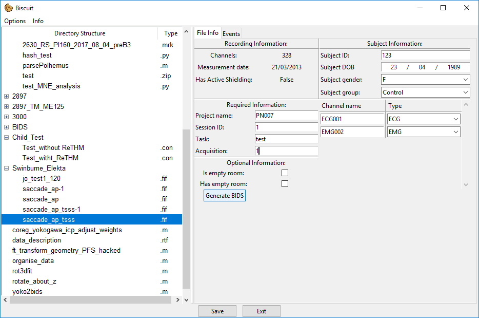

# Converting Elekta data

Data exported from Elekta MEG machines is stored entirely in a single `.fif` file per run. Because of this all the information required to be added can be entered on one single file.

## FIF file window

There are a number of fields that need to be completed before the `.fif` file is ready for conversion.

### Experimental information

#### Required information
- **Project Name**: ID of the project. This should match the project ID specified in the project settings so that any default values can be applied automatically.
- **Session ID**: Session number with the particular participant.
- **Task**: A shorthand identifier for the task performed.
- **Run**: An integer identifier for the run or block number (often just `1`, `2` etc.).

#### Subject information
- **Subject ID**: The ID used to identify the participant in a confidential manner.
- **Subject DOB**: The date of birth of the participant. This is entered in *dd/mm/yyy* format (sorry America!).
- **Subject Gender**: One of M (Male), F (Female), U (Unknown).
- **Subject Group**: The group within the study the participant belongs to. THe default values are `Participant` and `Control`, however these can be set in the [project default settings](guide_general.md#settings_window).

#### Optional information
- **Is empty room**: If this is selected the file is specified as the empty room data. Empty room data is copied to a different location and named based on the date of the recording. You should only select one empty room recoring per day otherwise any other existing empty room recording will be overwritten by the new one.
- **Has empty room**: If this is selected the BIDS data will contain a path pointing to the location of empty room file from the same recording day. Note that there is not check on whether or not this empty room file actually exists as this data can be produced after the BIDS conversion occurs for this file. If you do not have any empty room data that was taken on the same day as this con file, **do not** check this box as the data will not be correct.

#### Channel name overrides
As Elekta data can contain `BIO` channels which can contain data from `EMG`, `ECG` or `EOG` sources we need some way to specify the data on these channels.
Currently the channel names section will display all channels that have the `BIO` type.
You can rename the channel if you wish, and also specify the type of data on the channel so that the BIDS conversion process can correctly output the right channel type.

## Exporting the data
When all the required information has been entered, the `Generate BIDS` button will become active.

To export you simply press this button once and a popup will appear which gives the current progress of the export process.
Once the conversion is done the popup will close and the data will available in the `BIDS` folder that will be in the file view.
