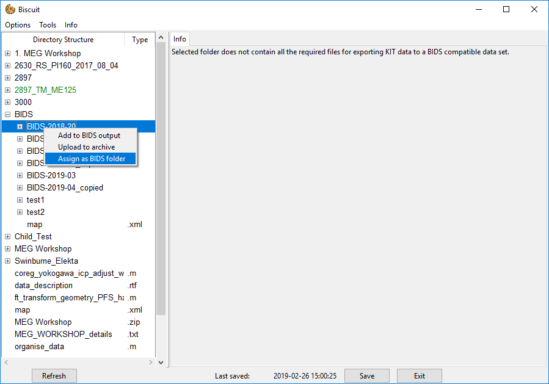
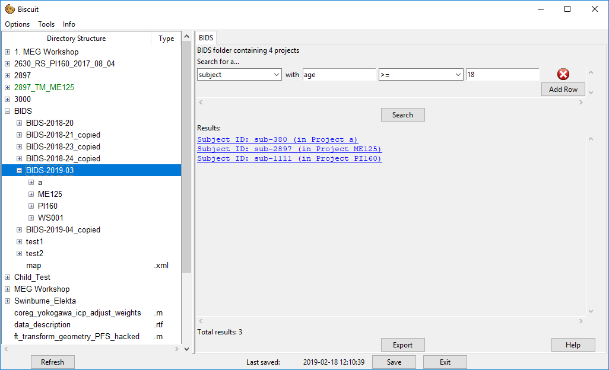
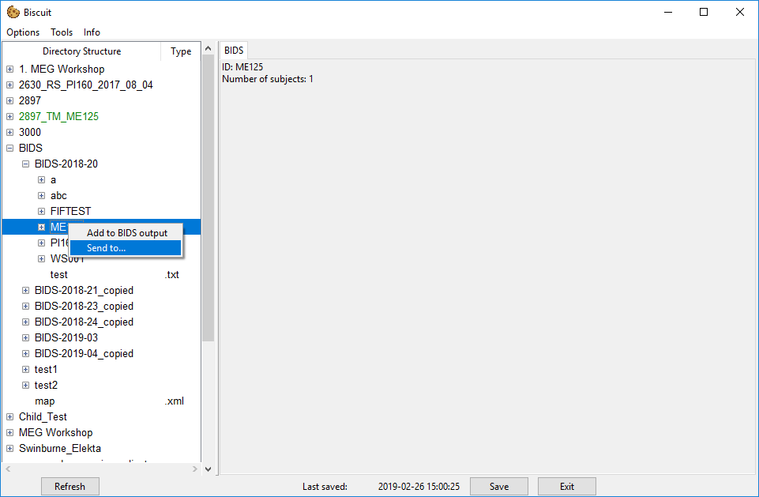
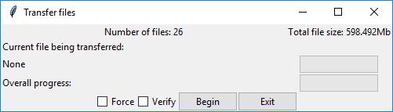

# General Usage

Biscuit can be run by running the `GUI.py` file with Python.
Upon running the script you will be greeting with two pop-ups.
The first pop-up will ask you to select the location of your MEG data. You need to select the parent folder that contains all of your MEG data, instead of a single folder which contains data from one session.
For example, if you have a folder set up like
```
Main folder
└ Elekta Data
    └ Proj1
        - file1.fif
        - file2.fif
    └ Proj2
        - file1.fif
└ KIT Data
    └ Proj1
        - file.con
        - file.mrk
        ...
```
then you want to select the `Main folder` as all the sub folders will be able to be navigated to within Biscuit.
You shouldn't ever need to or want to change this directory as this can render any of Biscuit's save data incompatible.

## Main window

Selecting a folder as shown will bring up the *Folder Info* tab where you can enter important info about the recording session. In general, if a field is red, it is required for conversion to BIDS format, and the process won't be allowed until a session has no red fields remaining.

## Settings windows

To make the BIDS conversion process as quick and easy as possible, Biscuit is able to store the settings for any projects you have to reduce the amount of information needed to be entered.
Each project has it's own settings, so any file that is given the specified project number will automatically have these settings applied to it.

For a detailed guide on how to add new project settings click [here](guide_new_proj_settings.md).

## General navigation

Biscuit is split in two halves.
The left side consists of a file treeview which is used to navigate the directories containing all the various files. Selecting any file will bring up information if there is info available. Most files that are not used for MEG will simply have the message that the data type is not supported. Some human-readble text files will be displayed however. This includes *MATLAB* `.m` files, *Python* `.py` scripts and `.txt` files. Both `.py` and `.m` files also support syntax highlighting (requires the [pygments](https://pypi.org/project/Pygments/) python library)

The right side displays all the file information for the selected file. This view is a tabbed which `.con` and `.fif` files utilise to gain a *Channels* and *Events* tab respectively.

## Biscuit is BIDS aware

Once a some data has been converted into BIDS format it will appear in a subfolder named `BIDS-20XX-YY` where `XX` will be the year and `YY` will be the fortnight number (this can be configured in the settings window if you do not want the export process to check the BIDS data. This is only like this for institutions who may want to back up data regularly).

Right-clicking on this folder will bring up a context menu with the option to "assign as BIDS folder".

Selecting this option will check whether the folder contains data that conforms to the BIDS specification, and if so it will parse some of the data and load it into a data structure. This information can then be seen when selecting the Folder itself, or the subsequent project, subject or session folders.

Once a folder is recognised to be a BIDS folder, a number of new options become available.
Firstly it is possible to search for data within the BIDS folder.

Multiple search terms may be chained together, and clicking the result automatically opens up the location in the file tree that the project/subject/session/scan resides in.

Secondly it is possible to transfer the BIDS data to another location by using the "send to..." context menu option.

It is **HIGHLY RECOMMENDED** that you use this method to transfer data to another location as it will retain any BIDS data including automatically transferring any associated empty room data.

