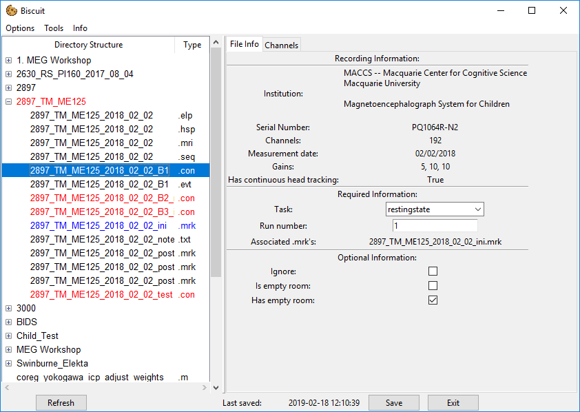
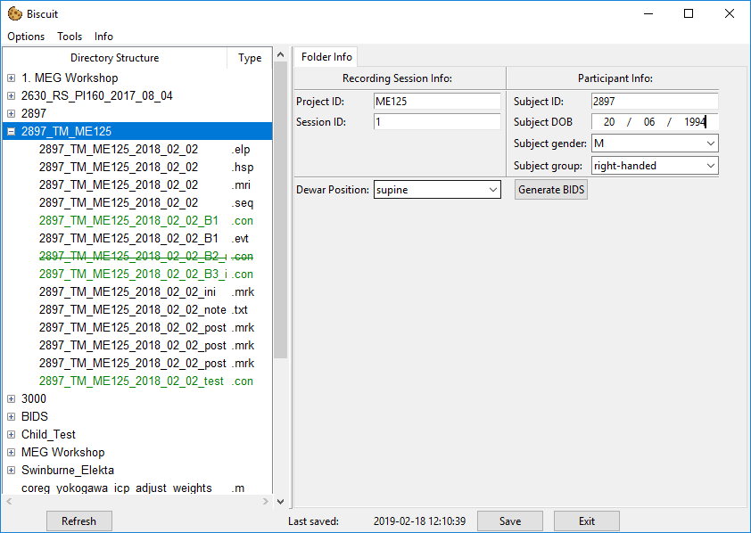

# Converting KIT data

To convert KIT we require a few steps. It may look like a bit at first, but once you undertsand the process it can be done in a very short amount of time.
Because KIT data consists of multiple files unlike Elekta data which consists of a single `.fif` file, the main object is the parent folder containing the `.con`, `.mrk`, `.elp`, and `.hsp` files.

## KIT data folder
When you first click on a folder containing all the required files the info panel will be populated with a number of info boxes and entires:

If you however select a folder which doesn't contain all the required files, the information panel will inform you of this

We require some information to be filled out on this screen:

#### Required information
- **Project Name**: ID of the project. This should match the project ID specified in the project settings so that any default values can be applied automatically.
- **Session ID**: Session number with the particular participant.

#### Subject information
- **Subject ID**: The ID used to identify the participant in a confidential manner.
- **Subject DOB**: The date of birth of the participant. This is entered in *dd/mm/yyy* format (sorry America!).
- **Subject Gender**: One of M (Male), F (Female), U (Unknown).
- **Subject Group**: The group within the study the participant belongs to. THe default values are `Participant` and `Control`, however these can be set in the [project default settings](guide_general.md#settings_window).

#### Other information
- **Dewar Position**: How the Dewar is positioned. You have a choice of *supine* or *upright*.

Before the `Generate BIDS` can become active all child `.con` files must appear green in the file treeview to indicate they have been all the required information (or are junk in some cases). See the following section on how to prepare each `.con` file.

## .CON file window

The `.con` file is the primary building block of KIT data and as such eash one requires a reasonable amount of information for BIDS conversion to happen.

### Experimental information

#### Required information
- **Task**: A shorthand identifier for the task performed.
- **Run**: An integer identifier for the run or block number (often just `1`, `2` etc.).
- **Associated .mrk's**: A list of any `.mrk` files that are associated with this `.con` file. Details on how to do this [here](guide_kit.md#associating-a-mrk-file)

#### Optional information
- **Ignore**: This indicates that the `.con` file isn't needed as part of the data set. The file will not be copied to the BIDS folder.
- **Is empty room**: If this is selected the file is specified as the empty room data. Empty room data is copied to a different location and named based on the date of the recording. You should only select one empty room recoring per day otherwise any other existing empty room recording will be overwritten by the new one.
- **Has empty room**: If this is selected the BIDS data will contain a path pointing to the location of empty room file from the same recording day. Note that there is not check on whether or not this empty room file actually exists as this data can be produced after the BIDS conversion occurs for this file. If you do not have any empty room data that was taken on the same day as this con file, **do not** check this box as the data will not be correct.

### Channel information

It is often important to specify if a certain channel is bad, or if a channel has any trigger information on it so that *MNE* can process this information properly and *MNE-BIDS* can produce the correct event information on export.
If you have set up any default channels when [setting up your project defaults](guide_general.md#settings-windows), then you will automatically see any channels specified as trigger channels in the channel tab, along with their default trigger description.

You can however add any other channel detected in the `.con` file to add to the list if you need to add extra trigger channels for the particular recording.

## Associating an `.mrk` file

It is crucial for each `.con` file to know what `.mrk` file was used during the recording.
We can associate a `.con` file with an `.mrk` file in one of 3 different ways, all achieved by *right-clicking* on the `.mrk` or `.con` file in question.

1. *Right-click* on a **`.con`** file and select `associate`. This will prompt you to select an **`.mrk`** file to associate with the `.con` file. You can do this by *right-clicking* the `.mrk` file you wish to associate and then selecting `associate`.
2. *Right-click* on an **`.mrk`** file and select `associate`. Same as above but you select the `.con` file the `.mrk` is to be associated with.
3. *Right-click* on an **`.mrk`** file and select `associate with all`. This will associate the selected `.mrk` file with *every* `.con` file in the same directory.

Once an `.mrk` has been associated with a `.con` file, selecting a `.con` file will highlight any associated `.mrk` files in blue in the file treeview on the left hand side. You can use this to confirm that you have associated the correct `.mrk` file with the correct `.con` file.

Note that you cannot associate more than 2 `.mrk` files with any given `.con` file.

## Exporting the data
When all the required information has been entered, the `Generate BIDS` button will become active.

To export you simply press this button once and a popup will appear which gives the current progress of the export process.
Once the conversion is done the popup will close and the data will available in the `BIDS` folder in the file view.
If you close the popup for whatever reason you can re-open it by simply clicking on the `Generate BIDS` button again.