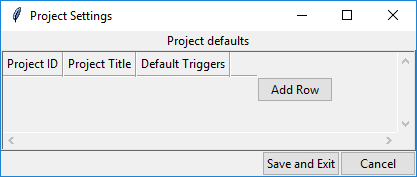
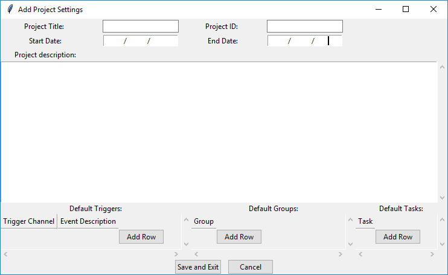
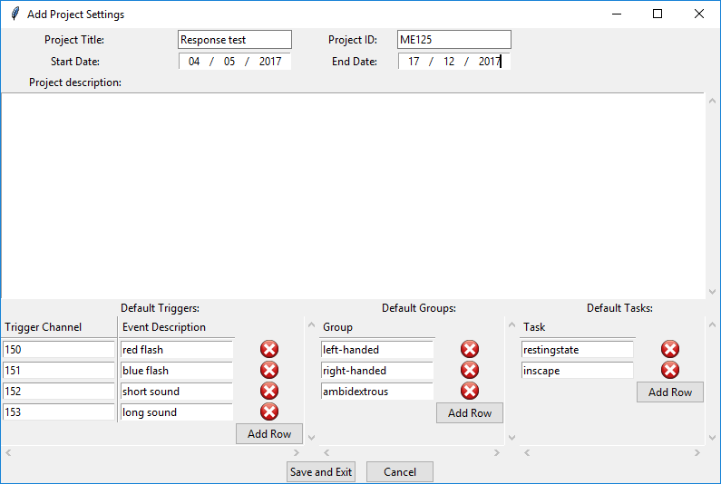
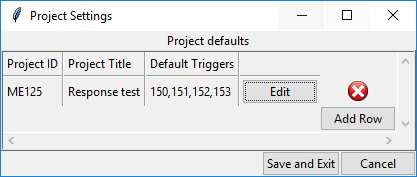

# Adding new project settings

To add new settings or edit existing settings select `Options > Set Defaults` from the menu.
The first time you run Biscuit you will be greeted with an empty list of project settings.

This view displays some condensed information about the project so that you can see quickly what the important current settings are.
To add settings for a new project select the `Add Row` button.

### Add new project settings

The new project settings popup allows for a fair bit of information to be entered.
It is worth spending some time to enter in any project information here as the information is applied to all relevant data.

#### Entry field descriptions

- **Project Title**: A short title for your project. This will be placed in the readme generated.
- **Project ID**: This is the ID of your project. Generally this will be an alphanumeric identifier that all experiments within a test will share. It is this value that tells Biscuit what experimental data should be using the project settings.
- **Start/End Date**: Starting and finishing dates of the project. These are not required but are good to provide for record keeping. If the end date is unknown it can be left blank.
- **Project Description**: A free-form field where you can enter any information about the project. As much information about the project should be included here as possible as this is the only place where you can put whatever you want.
- **Trigger Channels**: This is a list where you can add as many trigger channels as you require. For each row you enter the channel number and the description of the event on this channel. This information will automatically be displayed in the channels tab where extra channels can be added if particular runs use more or less trigger channels than the default settings.
- **Participant Groups**: A list of all the participant groups within the project. The default values for any project are `Participant` and `Control`. If you wish to have groups different to these values you can simply add as many groups as you require and these will appear in the Subject info entry area for the experimental data.

Once you have entered some information your project settings will look something like

To save the settings simply press *Save* and the new settings will appear in the list of project settings

